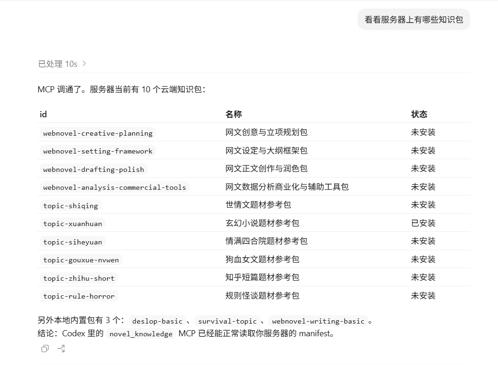

# Novel-Harness

把 AI 变成小说创作团队：**先规划、再写作、再审稿、还能记住上下文，也能按需补充参考资料。**

普通 AI 写小说容易忘设定、断伏笔、章节割裂、AI 味重。`novel-harness` 用 `/novel-core` 把创作拆成总编、规划、写作、审稿、上下文五个 Agent，适合持续写同一本长篇网文。

项目现在也带有一个测试版知识包市场维护能力：服务器维护可下载的题材包、写作包和去 AI 化参考包，本地 MCP 负责查看列表、安装到 `.harness/knowledge/remote/`，再交给 RAG 做本地检索。当前阶段只开放下载和本地安装，不开放普通用户上传。

---

## 1. 安装

把下面这句话发给 Codex、Claude Code、Cursor 或 OpenCode：

```text
请阅读 docs/install.md，帮我安装 novel-core，并确认之后可以用 /novel-core 帮我写小说 触发。
```

安装文档：[docs/install.md](docs/install.md)

安装后直接输入：

```text
/novel-core 帮我写小说
```

---

## 2. 它能帮你做什么

- **开书**：题材定位、主角设定、世界观、黄金三章方向
- **规划**：大纲、反转、阶段目标、升级节奏、爽点链条
- **写正文**：按当前项目状态续写章节或片段
- **审稿**：查逻辑、查节奏、查设定、查语病
- **去 AI 味**：减少解释腔、自问自答、过度因果、段尾总结
- **管上下文**：维护角色状态、章节摘要、伏笔、事件索引
- **沉淀参考**：把题材样本、拆书规则、去 AI 化规则放入 RAG 检索
- **扩展知识包**：通过本地 MCP 查看测试版知识包市场，并按需安装题材包、写作包、去 AI 化包

复制即用：

```text
/novel-core 帮我创建一本全民求生小说
/novel-core 帮我规划黄金三章
/novel-core 写第一章
```

```text
/novel-core 续写下一章
/novel-core 按当前大纲写一段正文
/novel-core 继续写，但保持主角状态和伏笔一致
```

```text
/novel-core 帮我审稿
/novel-core 查一下逻辑问题和节奏问题
/novel-core 这章哪里像 AI，帮我改自然
```

只说“帮我写小说”时，系统不会直接乱写正文，而是先进入开书规划，确认题材、主角、世界观和开局方向。

---

## 3. RAG 参考检索

RAG 用来检索项目里的题材参考、去 AI 味规则、审稿规则和案例文档。参考资料越多，它越能帮 Agent 找到合适的拆书样本、题材规则和人性化写法。

随项目自带的知识包位于 `.harness/knowledge/included/`，后续 MCP 下载的扩展知识包会进入 `.harness/knowledge/remote/`，再由 RAG 在本地构建索引。

开书、设计背景、大纲或正式写作前，系统会先推荐可选素材包；没有精准匹配时只给相近选项。用户确认前，不会强制启用任何题材包。

查看当前知识包：

```powershell
python rag/scripts/sync_packs.py list
python rag/scripts/sync_packs.py installed
```

第一次写小说可以先不启用 RAG；当你开始积累题材参考、拆书资料、去 AI 化案例后，建议安装并重建索引：

```powershell
pip install -r rag/requirements.txt
python rag/scripts/build_index.py
```

详细说明见：[知识包说明](docs/knowledge-packs.md)、[RAG 操作手册](rag/OPERATIONS.md)

---

## 4. 知识包下载与本地 MCP

`novel-harness` 当前有一个测试版知识包下载链路，用来把服务器上的参考资料安装到本地 RAG。它不是完整的云平台，也不开放用户上传；现阶段只做“服务器列出可下载包，本地按需安装”。

```text
阿里云 OSS / 服务器
  └── 保存知识包 zip，并提供 manifest 与下载接口

本地 MCP
  └── 调用本仓库的 sync_packs.py，完成列表、安装、更新、删除和重建索引

本地 RAG
  └── 从 .harness/knowledge/remote/ 读取已安装知识包并构建索引
```

本地 MCP 服务入口：

```powershell
python rag/mcp/knowledge_server.py
```

默认已配置测试版知识包市场，一般不需要手动传 manifest 地址。

当前可用工具：

```text
list_knowledge_packs
install_knowledge_pack
update_knowledge_pack
remove_knowledge_pack
list_installed_packs
rebuild_rag_index
```

目前已经验证：Codex 可以通过本地 MCP 读取服务器 manifest，看到 10 个云端知识包，并安装到 `.harness/knowledge/remote/`。后续再把它接入总编 / 规划 / 写作 / 审稿 Agent 的“缺资料时建议安装”流程。



---

## 5. 专项文档

- [系统架构](docs/architecture.md)
- [Agent 体系](docs/agents.md)
- [创作管线](docs/pipeline.md)
- [项目自定义与 Git 工作流](docs/usage.md)
- [知识包说明](docs/knowledge-packs.md)
- [RAG 操作手册](rag/OPERATIONS.md)

---

## 6. 去 AI 化效果示例

`human-linguistics` 模块用于把偏工整、解释感重的 AI 文风，调整成更接近真人网文作者的叙述口气。

| 优化前 | 优化后 |
|:---:|:---:|
|  |  |

---

## 7. 当前扩展能力

### 测试版知识包 MCP

`novel-harness` 现在有一个本地 MCP 入口，用来管理远程知识包。

它目前解决的问题：

- 从服务器 manifest 查看当前可用的参考资料包。
- 把选中的 zip 包下载并安装到 `.harness/knowledge/remote/`。
- 安装后重建本地 RAG 索引，让 Agent 可以检索这些参考资料。
- 保持服务器只负责分发，本地 MCP 只负责写入本机仓库。

当前已支持：

- 随项目自带知识包：去 AI 味、网文写作基础、全民求生。
- 云端知识包：创意规划、设定框架、正文润色、商业化工具、玄幻、世情、四合院、狗血女文、知乎短篇、规则怪谈等。
- 本地 MCP 工具调用：`list_knowledge_packs`、`install_knowledge_pack`、`rebuild_rag_index` 等。

当前边界：

- 测试阶段不开放普通用户上传。
- 本地 MCP 不直接访问 OSS，只请求服务器 manifest 和下载接口。
- 服务器不写入用户本地 RAG，所有安装和索引都在用户本机完成。

---

## 致谢

[](https://linux.do)

感谢 **linux.do** 社区的讨论、分享与支持。这个项目在方法论整理、实践思路和持续迭代上，都受益于社区氛围与成员交流。

感谢 [oh-story-claudecode](https://github.com/worldwonderer/oh-story-claudecode) 和 [webnovel-writer](https://github.com/lingfengQAQ/webnovel-writer) 给本项目带来的启发。
