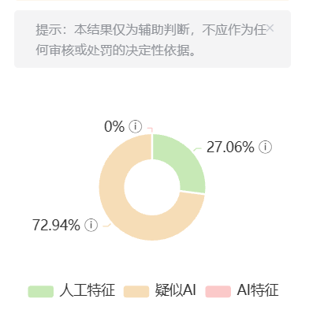
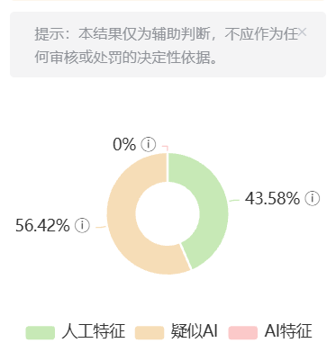

# Novel-Harness

把 AI 变成小说创作团队：**先规划、再写作、再审稿、还能记住上下文。**

普通 AI 写小说容易忘设定、断伏笔、章节割裂、AI 味重。`novel-harness` 用 `/novel-core` 把创作拆成总编、规划、写作、审稿、上下文五个 Agent，适合持续写同一本长篇网文。

---

## 1. 安装

把下面这句话发给 Codex、Claude Code、Cursor 或 OpenCode：

```text
请阅读 docs/install.md，帮我安装 novel-core，并确认之后可以用 /novel-core 帮我写小说 触发。
```

安装文档：[docs/install.md](docs/install.md)

安装后直接输入：

```text
/novel-core 帮我写小说
```

---

## 2. 它能帮你做什么

- **开书**：题材定位、主角设定、世界观、黄金三章方向
- **规划**：大纲、反转、阶段目标、升级节奏、爽点链条
- **写正文**：按当前项目状态续写章节或片段
- **审稿**：查逻辑、查节奏、查设定、查语病
- **去 AI 味**：减少解释腔、自问自答、过度因果、段尾总结
- **管上下文**：维护角色状态、章节摘要、伏笔、事件索引
- **沉淀参考**：把题材样本、拆书规则、去 AI 化规则放入 RAG 检索

复制即用：

```text
/novel-core 帮我创建一本全民求生小说
/novel-core 帮我规划黄金三章
/novel-core 写第一章
```

```text
/novel-core 续写下一章
/novel-core 按当前大纲写一段正文
/novel-core 继续写，但保持主角状态和伏笔一致
```

```text
/novel-core 帮我审稿
/novel-core 查一下逻辑问题和节奏问题
/novel-core 这章哪里像 AI，帮我改自然
```

只说“帮我写小说”时，系统不会直接乱写正文，而是先进入开书规划，确认题材、主角、世界观和开局方向。

---

## 3. RAG 参考检索

RAG 用来检索项目里的题材参考、去 AI 味规则、审稿规则和案例文档。参考资料越多，它越能帮 Agent 找到合适的拆书样本、题材规则和人性化写法。

第一次写小说可以先不启用 RAG；当你开始积累题材参考、拆书资料、去 AI 化案例后，建议安装并重建索引：

```powershell
pip install -r rag/requirements.txt
python rag/scripts/build_index.py
```

详细说明见：[RAG 操作手册](rag/OPERATIONS.md)

---

## 4. 架构与文档

- [系统架构](docs/architecture.md)
- [Agent 体系](docs/agents.md)
- [创作管线](docs/pipeline.md)
- [项目自定义与 Git 工作流](docs/usage.md)
- [RAG 操作手册](rag/OPERATIONS.md)

`novel-harness` 不是单个提示词，而是一套四层创作管线：

```text
L0  项目上下文
    当前写哪本书、项目约束、角色状态、章节摘要、伏笔和事件索引

L1  总编 Agent
    理解需求、判断任务、分派规划 / 写作 / 审稿 / 上下文 Agent

L2  专业 Agent
    规划 Agent：大纲、黄金三章、反转、爽点
    写作 Agent：按项目状态和大纲写正文
    审稿 Agent：查逻辑、节奏、语病、AI 味
    上下文 Agent：管理角色、伏笔、章节状态

L3  规则与知识层
    .harness/skills/ 题材规则、语感规则、情节规则、节奏规则
    rag/             题材参考、拆书资料、去 AI 化经验的检索层
```

核心入口文件：

```text
skills/novel-core/SKILL.md       # /novel-core 安装入口
.harness/agents/总编Agent.md     # 真正的总编调度规则
.harness/agents/                 # 规划 / 写作 / 审稿 / 上下文 Agent
.harness/skills/                 # 题材、语感、情节、节奏规则
```

---

## 5. 去 AI 化效果示例

`human-linguistics` 模块用于把偏工整、解释感重的 AI 文风，调整成更接近真人网文作者的叙述口气。

| 优化前 | 优化后 |
|:---:|:---:|
|  |  |

---

## 6. 目录说明

```text
novel-harness/
├── README.md                  # 项目说明
├── AGENTS.md                  # Codex / OpenCode 入口规则
├── CLAUDE.md                  # Claude Code / Cursor 可参考入口规则
├── skills/novel-core/         # 可安装的 Codex Skill 入口
├── .harness/                  # 核心 Agent、规则、模板
│   ├── agents/                # 总编 / 规划 / 写作 / 审稿 / 上下文 Agent
│   ├── skills/                # 题材、语感、情节、节奏模块
│   ├── project-templates/     # 小说项目约束模板
│   └── memory/                # 章节、角色、伏笔、事件记忆模板
├── rag/                       # 轻量 RAG 检索模块
└── docs/                      # 详细文档与可选安装脚本
    └── scripts/install-skill.ps1
```

小说正文项目不随仓库上传。开始创作时，Agent 会在本地使用或创建 `projects/{项目名}/`，用于存放正文、大纲、设定、状态和记忆文件。

---

## 致谢

[](https://linux.do)

感谢 **linux.do** 社区的讨论、分享与支持。这个项目在方法论整理、实践思路和持续迭代上，都受益于社区氛围与成员交流。

感谢 [oh-story-claudecode](https://github.com/worldwonderer/oh-story-claudecode) 和 [webnovel-writer](https://github.com/lingfengQAQ/webnovel-writer) 给本项目带来的启发。
